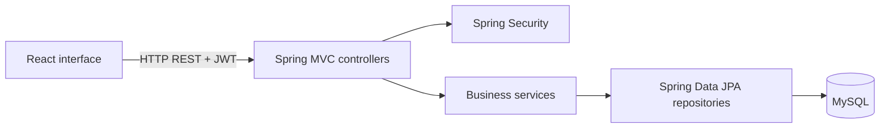

# Technical Incident Management System

A full-stack student portfolio application for reporting, assigning and tracking IT support incidents. Built with **Spring Boot, React and MySQL**, it demonstrates REST API design, role-based workflows, relational data modeling and frontend/backend integration.

The application interface and domain identifiers are primarily in French. This documentation is in English.

## Features

- JWT authentication, BCrypt password hashing and role-based access for administrators, support managers, technicians and employees.
- Incident reporting with categories, priorities, equipment details and search/filter controls.
- Technician assignment and reassignment, diagnosis, resolution confirmation and closure.
- Comments, internal notes, incident history and in-app notifications.
- Dashboards and statistics with charts and workload indicators.
- User accounts, departments and category administration.

These capabilities are present in the source; this cleaned release has not been tested end to end against MySQL.

## Technology stack

| Layer | Technologies |
| --- | --- |
| Backend | Java 17 target, Spring Boot 4.1.0, Spring MVC, Spring Security, Spring Data JPA, Lombok |
| Authentication | JWT 0.11.5, BCrypt |
| Database | MySQL, Hibernate |
| Frontend | React 18, React Router 6, Axios, Recharts |
| Tooling | Maven wrapper, Vite 5, npm lockfile |

Dependency versions are preserved from the original project. Use Node.js 22 and a JDK compatible with the Maven dependencies (Java 17 or later).

## Architecture



```text
.
├── pom.xml / mvnw / mvnw.cmd     Maven build and wrapper
├── src/main/java/com/example/gestionproblemes/
│   ├── controller/               REST endpoints
│   ├── service/                  Business rules
│   ├── model/                    Persistence entities
│   ├── repository/               Queries and filters
│   ├── security/                 JWT and access control
│   ├── config/                   Errors and optional fictional demo data
│   └── enums/                    Roles and lifecycle states
├── src/main/resources/           Environment-backed configuration
├── src/test/                     Existing Spring context test
├── gestion-incidents-front/      React/Vite application
└── docs/screenshots/             Screenshot instructions
```

## Run locally

### 1. Create an isolated database

Create a fresh MySQL database named `incident_management` and a dedicated local database user with privileges on that database only. Supply its credentials in the next step. Do not point the demo at an existing institutional or production database: Hibernate uses `ddl-auto=update`.

### 2. Configure and start the backend

From the repository root, set the following environment variables in PowerShell. Replace the database placeholders locally. The commands generate new random values for the JWT key and local account passwords; no fixed credentials are shipped.

```powershell
$env:DB_URL = 'jdbc:mysql://localhost:3306/incident_management'
$env:DB_USERNAME = 'YOUR_DATABASE_USER'
$env:DB_PASSWORD = 'YOUR_DATABASE_PASSWORD'
function New-LocalSecret {
    $bytes = New-Object byte[] 32
    $rng = [System.Security.Cryptography.RandomNumberGenerator]::Create()
    try { $rng.GetBytes($bytes) } finally { $rng.Dispose() }
    [Convert]::ToBase64String($bytes)
}
$env:JWT_SECRET = New-LocalSecret
$env:TEMPORARY_ACCOUNT_PASSWORD = New-LocalSecret
$env:DEMO_PASSWORD = New-LocalSecret
$env:DEMO_DATA_ENABLED = 'true'
$env:CORS_ALLOWED_ORIGINS = 'http://localhost:3000'
.\mvnw.cmd spring-boot:run
```

On macOS/Linux, export the same variables, generate secrets with `openssl rand -base64 32`, and run `chmod +x mvnw && ./mvnw spring-boot:run`.

The API listens on `http://localhost:8080`. The committed `application.properties` contains environment references only. `application-example.properties` is a reference template, not a required active profile. Spring Boot does not automatically load a frontend `.env` file.

### 3. Start the frontend

Open a second terminal:

```powershell
cd gestion-incidents-front
npm ci
Copy-Item .env.example .env.local
npm run dev
```

Visit `http://localhost:3000`. The example frontend setting is `VITE_API_URL=http://localhost:8080/api`. Values prefixed with `VITE_` are public browser configuration; never put secrets there.

### 4. Explore the demo

The optional initializer creates one fictional department, one category and these accounts when the user table is empty:

| Account | Role |
| --- | --- |
| admin@example.com | Administrator |
| support@example.com | Support manager |
| technician@example.com | Technician |
| employee@example.com | Employee |

All four initially use the locally generated `DEMO_PASSWORD`. Stop the backend with Ctrl+C and inspect `$env:DEMO_PASSWORD` in that same terminal if you need to copy it for login; restart without regenerating it. No password is written to application logs.

Create a fictional incident as the employee, assign it as the support manager, and diagnose/resolve it as the technician. Use these actions to populate dashboard statistics and capture portfolio screenshots.

Seeding is disabled by default. After the first run, set `DEMO_DATA_ENABLED=false`. Existing accounts are not overwritten when environment values change. Preserve your chosen local demo password outside Git or change it through the profile screen.

Account creation without an explicit password and the administrator reset action use `TEMPORARY_ACCOUNT_PASSWORD`. It must be configured locally; recipients should change it through their profile. This inherited shared reset workflow is suitable only for a local demonstration and should be replaced with individual expiring reset tokens before production use.

## Selected API routes

| Route | Purpose |
| --- | --- |
| `POST /api/auth/login` | Sign in |
| `GET /api/auth/moi` | Current profile |
| `/api/problemes` | Incident operations |
| `/api/utilisateurs` | User administration |
| `/api/categories`, `/api/departements` | Reference data |

See the controller classes for HTTP methods, payloads and additional routes. Protected endpoints require `Authorization: Bearer <token>`.

## Screenshots

| Planned screenshot | File to add |
| --- | --- |
| Login | `docs/screenshots/login.png` |
| Dashboard | `docs/screenshots/dashboard.png` |
| Incident detail and history | `docs/screenshots/incident-detail.png` |
| User administration | `docs/screenshots/users.png` |

These are placeholders, not included images. Capture them using fictional local records only.

## Build and validation

```powershell
.\mvnw.cmd -DskipTests package
cd gestion-incidents-front
npm run build
```

The existing backend context test requires configured environment variables and a reachable test database. Run `mvnw.cmd test` against an isolated database with demo initialization disabled.

See [CLEANUP.md](CLEANUP.md) for the checks performed on this archive and their limitations. No production deployment or security audit is claimed. The browser currently stores JWTs in localStorage; deployment would require additional authentication, transport and operational hardening.

## Portfolio disclaimer

This is a student portfolio project based on an internship. This sanitized distribution contains no institutional confidential data: the original sample records and institutional branding have been removed, and all included demo identities are fictional. It is not an official institutional product and does not imply endorsement. No real database export, staff directory or institutional deployment configuration is included.

## GitHub preparation

Extract this archive and upload the repository contents, including `.gitignore`, to a repository you control when ready. Keep local secrets, dependencies and generated builds excluded. This preparation did not publish anything or access an external account. No new license has been assigned; choose one only if you hold the necessary rights.
